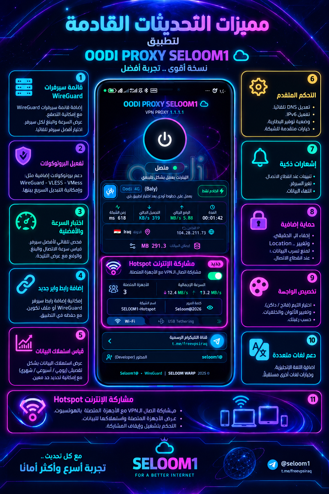

# 🚀 OODI Proxy Seloom1

<p align="center">
  <a href="https://github.com/seloom1/oodiproxy-shizzi/releases"></a>
  <a href="https://github.com/seloom1/oodiproxy-shizzi/releases"></a>
  <a href="https://github.com/seloom1/oodiproxy-shizzi/releases"></a>
</p>

<p align="center">
  
</p>

<p align="center"><strong>اتصال WireGuard أكثر استقراراً، مشاركة Shizuku، وتحكم أفضل بالشبكة.</strong></p>

## 🌐 نبذة عن المشروع

**OODI Proxy Seloom1** هو تطبيق Android مبني على Capacitor وWireGuard لتوفير واجهة عربية عملية لإدارة اتصالات VPN، مع دعم مشاركة اتصال الإنترنت عبر Shizuku بدون Root، مراقبة الاستخدام، وإدارة خوادم WireGuard من مكان واحد.

التطبيق مصمم ليكون خفيفاً وقابلاً للتوسع، ويستخدم Package Name مستقل:

```text
com.oodiproxyseloom1.shizzi
```

## 🆕 آخر تحديث — v2.1.0

يتضمن هذا الإصدار إضافة مشاركة الإنترنت عبر Shizuku بعد حذف ميزة NetShare، مع إضافة قياس قوة إشارة الشريحة وتحسين معلومات الشبكة.

كما يتضمن إصلاحات مهمة لاتصال وفصل VPN وWireGuard، وتحسين DNS وAllowedIPs، ومنع مشاكل IPv6 وDNS IPv6 مع الخوادم التي لا تدعمها، إضافةً إلى تحسين استقرار الخدمة في الخلفية واستثناء التطبيقات وتجربة الاستخدام بشكل عام.

## ✨ الميزات الحالية

### 🔐 اتصال WireGuard وإدارة الخوادم

- اتصال WireGuard أصلي عبر خدمة VPN على Android.
- إضافة عدة خوادم WireGuard وإدارتها محلياً.
- استيراد إعدادات WireGuard عبر رابط URI أو ملف إعدادات.
- اختيار الخادم النشط والتبديل بين الخوادم بسهولة.
- اختبار زمن الاستجابة Ping للخوادم واختيار الخادم الأفضل.
- تصدير إعدادات الخادم بصيغة `.conf` أو QR Code.
- حفظ الخوادم والإعدادات محلياً دون الحاجة إلى حساب.
- دعم DNS وMTU وPersistent Keepalive وAllowed IPs.
- خيار تجاوز مسارات الشبكة المحلية عند الحاجة.

### 🛡️ استثناء التطبيقات من VPN

- حقل مخصص في الواجهة الرئيسية لفتح إعدادات الاستثناءات.
- خيار مستقل داخل القائمة المنسدلة.
- عرض التطبيقات القابلة للتشغيل المثبتة على الجهاز.
- إظهار أيقونة التطبيق واسمه وPackage Name.
- البحث باسم التطبيق أو Package Name.
- التطبيقات المحددة تظهر في بداية القائمة.
- عرض عدد التطبيقات المستثناة.
- تمرير القائمة فعلياً إلى WireGuard عبر `ExcludedApplications`، وليس مجرد إعداد شكلي.
- حفظ التطبيقات المختارة محلياً وإعادة استخدامها عند الاتصال التالي.

### 📡 مشاركة الإنترنت وHotspot عبر Shizuku

- مشاركة اتصال الإنترنت مع الأجهزة المتصلة عبر Hotspot باستخدام Shizuku بدون Root.
- دعم Wi-Fi وUSB Tethering حسب إمكانيات الجهاز.
- عرض عدد الأجهزة المتصلة.
- عرض إجمالي البيانات المستخدمة في المشاركة.
- عرض سرعة التنزيل والرفع للأجهزة المشتركة.
- تغيير ثيم بطاقة المشاركة بين Cyan وViolet وGreen.
- إعداد اسم الشبكة وكلمة المرور وخيارات الشبكة من داخل التطبيق.

### ⚡ Shizzi + Shizuku

- دمج كود مشروع **Shizzi** داخل APK نفسه كموديول Android داخلي.
- تشغيل مشاركة Hotspot عبر Shizuku بدون Root.
- إنشاء test network وتمرير حركة الأجهزة المتصلة عبر نفق VPN.
- دعم IPv4 وIPv6 عبر datapath مبني بـGo وgomobile.
- فتح واجهة Shizzi من القائمة المنسدلة داخل OODI.
- ظهور التطبيق داخل تطبيق Shizuku ومنحه الصلاحية من هناك.
- دعم Quick Settings Tile وأوامر التشغيل والإيقاف والأتمتة الموجودة في Shizzi.

تم حذف ميزة NetShare من التطبيق واستبدالها بمكوّن Shizuku المدمج.

> يجب تثبيت تطبيق **Shizuku** وتشغيله أولاً عبر Wireless Debugging أو Root، ثم فتح خيار Shizzi داخل OODI ومنح الصلاحية من تطبيق Shizuku. هذه النسخة تتطلب Android 11 / API 30 أو أحدث ومعمارية ARM64.

### 📊 الإحصائيات والمراقبة

- عرض عنوان IP الخارجي والدولة عند الاتصال.
- عرض إجمالي التنزيل والرفع من نفق WireGuard.
- عرض مدة الاتصال وسرعة نقل البيانات.
- قراءة إحصائيات WireGuard الحقيقية بدلاً من أرقام تجريبية.
- سجل للاتصالات السابقة مع إمكانية مسحه.
- تحديث معلومات الشبكة يدوياً عند الحاجة.
- قياس قوة إشارة الشريحة وعرض معلومات SIM والشبكة الخلوية.

### 🎨 الواجهة وتجربة الاستخدام

- واجهة عربية RTL مناسبة للشاشات الصغيرة.
- تصميم داكن مع بطاقات واضحة وحالات اتصال ملونة.
- حقل استثناء التطبيقات موضوع في أسفل عناصر الواجهة مباشرة فوق قناة التليگرام.
- ألوان الحقول قابلة للتمييز دون سطوع مزعج.
- قائمة منسدلة تجمع إدارة الخوادم والإعدادات والتصدير والاستثناءات.
- دعم صور وأيقونات التطبيقات داخل قائمة الاستثناءات.

## 📦 بيانات الإصدار الحالي

| العنصر | القيمة |
|---|---|
| Package Name | `com.oodiproxyseloom1.shizzi` |
| Version Name | `2.1.0` |
| Version Code | `16` |
| Minimum Android | API 30 / Android 11 |
| Target SDK | API 36 |
| Release | [v2.1.0 على GitHub](https://github.com/seloom1/oodiproxy-shizzi/releases/tag/v2.1.0) |

## ⬇️ التحميل

- [تحميل Release APK](https://github.com/seloom1/oodiproxy-shizzi/releases/download/v2.1.0/oodiproxy-shizzi-v2.1.0-release.apk)
- [تحميل Debug APK](https://github.com/seloom1/oodiproxy-shizzi/releases/download/v2.1.0/oodiproxy-shizzi-v2.1.0-debug.apk)

> نسخة Release الحالية موقعة للتجربة المحلية. للنشر الرسمي على Google Play يجب استخدام keystore ثابت ومفتاح رفع محفوظ بشكل آمن، ويفضل رفع ملف Android App Bundle بصيغة `.aab`.

## 🧰 البناء محلياً

المتطلبات: Node.js، Android SDK، JDK 21، وAndroid Platform 36.

```bash
npm ci
npm run lint
npm run android:sync
cd android
./gradlew assembleDebug assembleRelease
```

مخرجات APK تكون داخل:

```text
android/app/build/outputs/apk/debug/
android/app/build/outputs/apk/release/
```

## ⚠️ ملاحظات مهمة

- تغيير Package Name أو مفتاح التوقيع يجعل Android يتعامل مع النسخة كتطبيق مختلف.
- يجب استخدام نفس مفتاح التوقيع في كل الإصدارات المستقبلية حتى تعمل التحديثات فوق النسخة الحالية.
- صلاحية `QUERY_ALL_PACKAGES` مستخدمة لعرض التطبيقات المثبتة مع أيقوناتها. عند النشر على Google Play يجب مراجعة سياسة Google الخاصة بهذه الصلاحية.
- نظام GitHub يعرض إشعار التحديث داخل التطبيق عند فتحه أو عند تنفيذ الفحص الدوري؛ لا يثبت APK تلقائياً دون تدخل المستخدم.

## 🇬🇧 English summary

OODI Proxy Seloom1 is an Arabic RTL Android WireGuard client built with Capacitor. It provides multi-server management, native WireGuard connectivity, Shizuku-based hotspot sharing without root, traffic statistics, SIM signal information, app exclusions with searchable app icons, local settings, and a GitHub-hosted in-app update manifest.

The current standalone application ID is `com.oodiproxyseloom1.shizzi`, version `2.1.0`, with Android API 30 as the minimum supported version and API 36 as the target SDK.

## 🙌 Credits

### 🤝 المشاريع والمكونات المشتركة

- **WireGuard** — تقنية نفق VPN مفتوحة المصدر والمكوّن الأساسي للاتصال المشفر.
- **WireGuard Android Tunnel** — مكتبة Android لتشغيل النفق وإدارته وقراءة إحصائياته.
- **Capacitor** — الجسر المستخدم لربط واجهة React/TypeScript بخدمات Android الأصلية.
- **React وTypeScript وVite** — تقنيات بناء الواجهة وتجهيز نسخة Android.
- **Android PackageManager** — قراءة التطبيقات وأسمائها وأيقوناتها لدعم استثناء التطبيقات من VPN.
- **GitHub Releases وGitHub Raw** — استضافة الإصدارات وملف التحديثات المجاني.
- **Shizzi — [carlelieser/shizzi](https://github.com/carlelieser/shizzi)** — مكوّن مشاركة Wi-Fi tethering عبر شبكة Shizuku المميزة، مدمج داخل هذا الـFork مع الإبقاء على نسبة المشروع لصاحبه.

### 🧑‍💻 المساعدون وأدوات التطوير

الشكر لكل من ساهم في تطوير الفكرة والمكونات والتجربة، ولأدوات **Android SDK وJDK وGradle وCapacitor CLI وGitHub CLI** المستخدمة في البناء والاختبار والنشر. كما تم استخدام مساعد برمجي للمساعدة في تصميم الواجهة، ربط JavaScript مع Android، اختبار TypeScript، إصلاح أخطاء البناء، تجهيز التوثيق، وإدارة الإصدارات.

> حقوق وأسماء المشاريع الخارجية محفوظة لأصحابها ومطوريها. يرد هذا القسم للتوثيق والامتنان وبيان المكونات المشتركة المستخدمة في المشروع.
